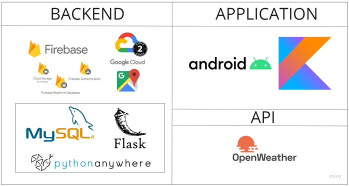
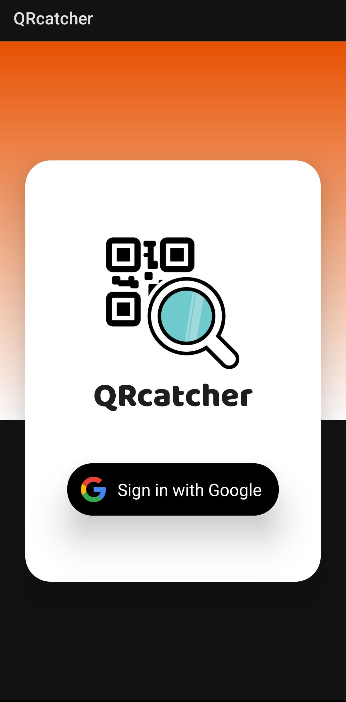
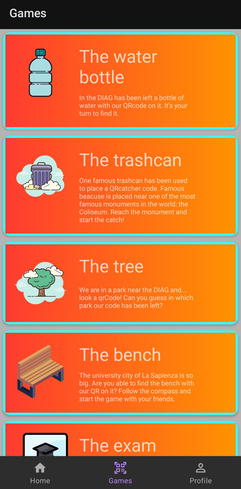
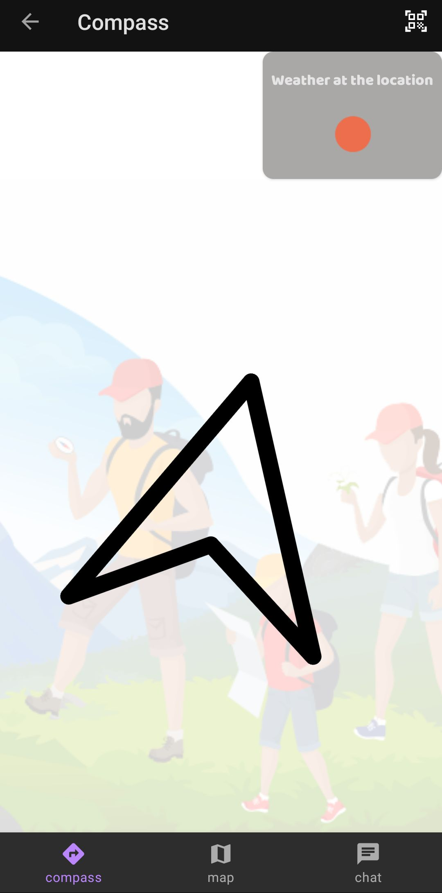
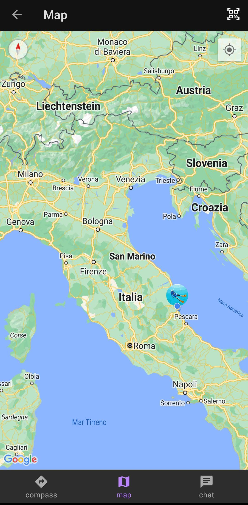
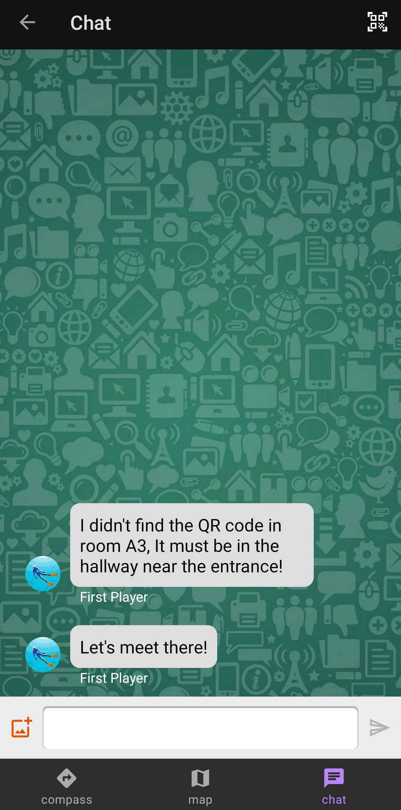

# QRcatcher
Android mobile application developed for the exam of Mobile Application and Cloud Computing at "La Sapienza" University of Rome (A.Y. 2022/2023).

## Idea
QRcatcher is an app based on the idea of a treasure hunt, are just different the modalities. You are required to find the correct QRcode that is placed on some random objects in order to win the game. Once you have selected a game to play a compass will guide you to the QRcode that you will have to scan with your camera to win the game. 
QRcatcher is also a multi-user game, you can join matches with your friends and being able to check in every moment where they are thanks to the integrated map available, moreover you can even chat with your teammates with the built-in chat in order to be up-to-date during the game. 

## Architecture

## Screenshots

#### Login

#### Games list

#### Compass

#### Map

#### Chat

## Authors

- [@lorenzoromans](https://github.com/lorenzoromans)
- [@bbooss97](https://github.com/bbooss97)